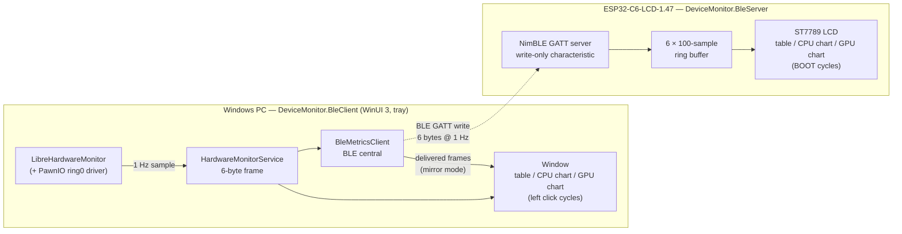

# DeviceMonitor

A Windows app reads real CPU/GPU metrics and streams them over BLE to an ESP32 board,
which shows them as a table on its LCD.

- **DeviceMonitor.BleClient** — WinUI 3 / .NET 10 desktop app (unpackaged). BLE central /
  GATT client. Reads CPU/GPU load, temperature and memory usage via LibreHardwareMonitorLib
  and writes a 6-byte frame once per second. Left mouse click in the window cycles the
  views: metrics table → CPU chart → GPU chart (~100 s rolling history). While connected
  the charts exactly mirror the device (fed from delivered frames only, restarted from
  zero at connect); while disconnected they fall back to local samples without resetting.
- **DeviceMonitor.BleServer** — PlatformIO firmware for the Waveshare **ESP32-C6-LCD-1.47**.
  BLE peripheral / GATT server: renders the metrics as a landscape 2×3 table on the 1.47"
  ST7789 LCD. The BOOT button cycles the same three views as the client.

## How it works



**Sensors (Windows).** LibreHardwareMonitorLib polls CPU load/temperature, RAM, GPU
load/temperature and VRAM once per second. Reading the CPU package temperature needs
ring0 access (the PawnIO driver) — that is why the app runs elevated. Each sample is
quantized into a 6-byte frame: `[cpuLoad%, cpuTemp°C, ramUsed%, gpuLoad%, gpuTemp°C,
vramUsed%]`, with `255` meaning "no reading" (e.g. no dedicated GPU).

**Transport (BLE).** The client is the BLE central. It scans for the `DeviceMonitor`
advertisement (matching device name or service UUID), connects, discovers the service and
characteristic with retries (GATT calls right after connect are transiently flaky on some
Bluetooth stacks), then writes the frame once per second using write-with-response.
`GattSession.MaintainConnection` keeps the link alive; when it drops, the client simply
returns to scanning and reconnects on its own — no user action, ever.

**Display (ESP32-C6).** NimBLE exposes a single write-only characteristic. Every received
frame lands in a per-metric 100-sample ring buffer and the main loop repaints the current
view: the metrics table or one of two chart views (CPU / GPU), cycled with the BOOT
button. Charts draw three lines (load / temp / mem) on a fixed 0–100 scale; a missing
reading breaks the line instead of plotting a fake zero. On disconnect values gray out to
`--` and the chart history resets.

**Desktop mirror.** The window shows the same three views, cycled with a left click. The
chart history is hybrid-sourced: while connected it restarts from zero and is fed only
with frames actually delivered over BLE, so it shows exactly what the device shows; while
disconnected it falls back to local samples without resetting, so the charts keep living
when the board is off.

## BLE contract (kept in sync on both sides)

| | Value |
|---|---|
| Device name | `DeviceMonitor` |
| Service UUID | `a1b2c3d4-0001-4a5b-8c6d-1234567890ab` |
| Metrics characteristic UUID | `a1b2c3d4-0002-4a5b-8c6d-1234567890ab` (write / write-no-response) |
| Payload | 6 bytes `uint8`: `[cpuLoad%, cpuTemp°C, ramUsed%, gpuLoad%, gpuTemp°C, vramUsed%]` |
| Sentinel | `255` (0xFF) = no reading → shown as `--` |

## Build & run

### Firmware (ESP32-C6)
Needs [PlatformIO](https://platformio.org/) (VS Code extension or the `pio` CLI) and the board on USB.

```
cd DeviceMonitor.BleServer
pio run -t upload
pio device monitor -b 115200
```

The first build downloads the ESP32-C6 toolchain, so it takes a while. On boot the LCD
shows the table (all `--`) and a muted `Advertising` status.

### Client (Windows) — must run elevated
Reading CPU temperature uses a ring0 driver, so the app requests Administrator
(`requireAdministrator` in `app.manifest`). **Run Visual Studio 2026 as Administrator**,
open `DeviceMonitor.sln`, set **DeviceMonitor.BleClient** as the startup project, and press
**F5** (otherwise F5 fails with an elevation error).

The client is a background app: it **connects automatically** (scanning/reconnecting on its
own), lives in the **system tray**, and minimizing or closing the window hides it there.
Left-click / double-click the tray icon to show the window; the tray menu has **Show**,
**Start with Windows** (a Task Scheduler logon task that starts it elevated + minimized),
and **Exit**.

> The solution builds only the WinUI project. The firmware appears as a solution folder
> for convenience but is built/flashed through PlatformIO, not Visual Studio.

## Test end-to-end
Power the board, launch the client → status becomes `Connected` and the LCD table shows the
same CPU/GPU numbers as the app window, updated every second. Sensors without a reading
(e.g. no dedicated GPU) show `--`. If the board is off/out of range the client keeps
scanning and reconnects when it reappears.

## License

[MIT](LICENSE).

The bundled [VT323](https://fonts.google.com/specimen/VT323) font is licensed separately
under the [SIL Open Font License 1.1](DeviceMonitor.BleClient/Assets/Fonts/OFL.txt).
